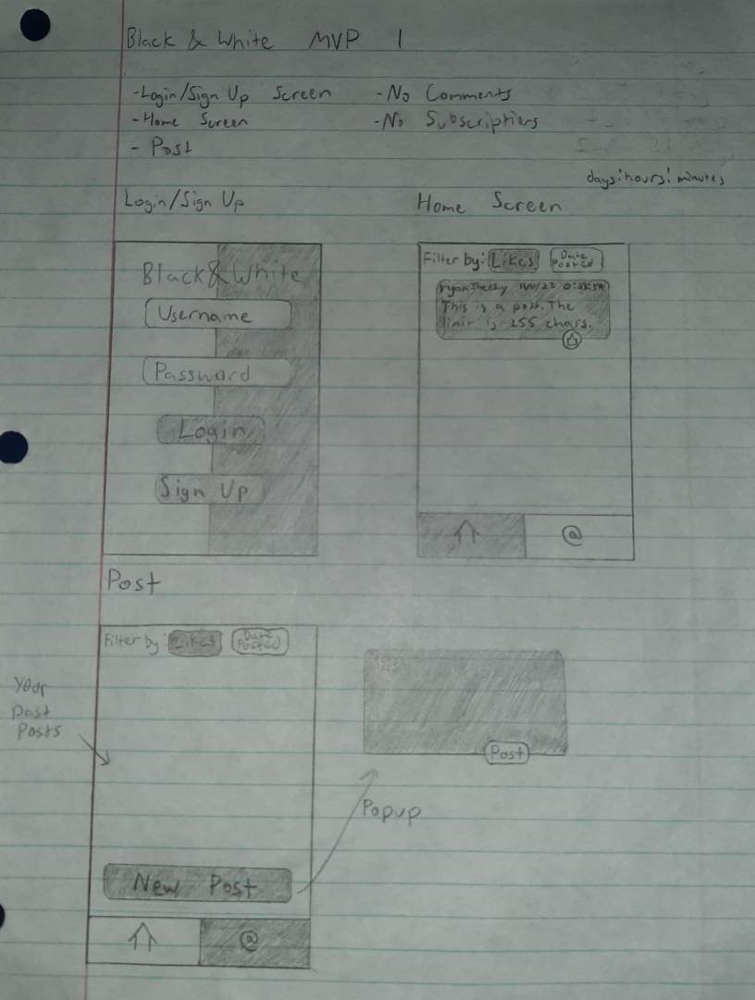
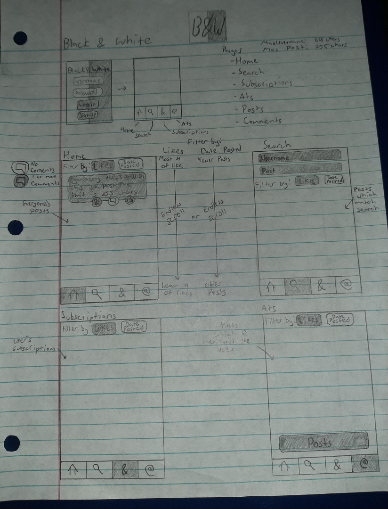
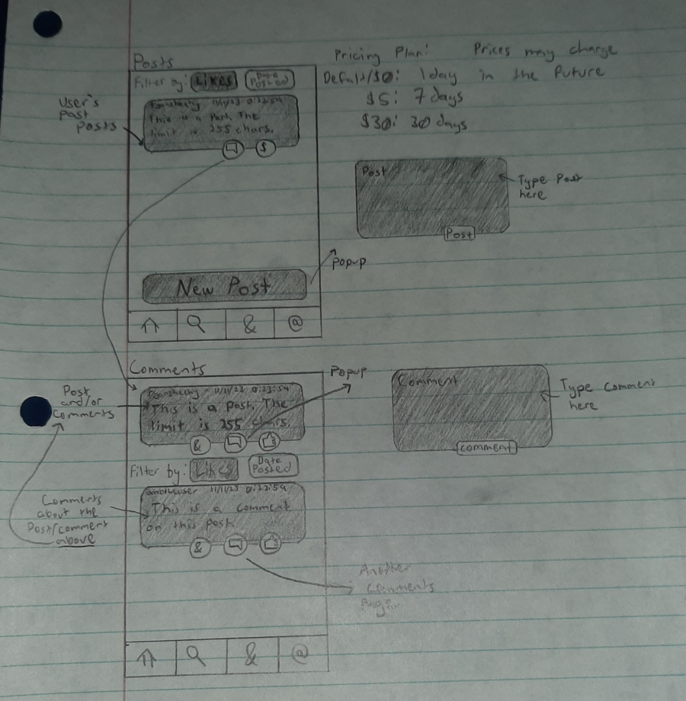

# Black & White
A simple social media app for just posting text.

## Description
Black And White is a social media app for posting text. Our app provides a space for users to express themselves through written content and like other users posted text, and also allows individuals to share their thoughts, opinions, and experiences with a wide audience.

## Table of Contents

<!-- TOC -->

- [Black & White](#black--white)
  - [Description](#description)
  - [Table of Contents](#table-of-contents)
  - [Installation](#installation)
  - [Usage](#usage)
  - [Features](#features)
  - [Tests](#tests)
  - [REPOSITORY](#repository)
  - [DEPLOYED LIVE URL](#deployed-live-url)
  - [Technologies](#technologies)
  - [Screen-shots](#screen-shots)
    - [Minimum Viable Product 1](#minimum-viable-product-1)
    - [Final Product](#final-product)

<!-- /TOC -->

## Installation
To run this application locally, follow these steps:
1. Clone the repository to your local machine:
    - git clone https://github.com/ryansheehy0/Black_And_White
1. Install the project dependencies:
    - cd Black_And_White
    - npm install
1. Create a `.env` file in the project root and add your environment variables (e.g., DN_NAME, JWT_SECRET).
1. Run the application:
    - npm run dev
1. Open your web browser and navigate to `http://localhost:3000` to access the application.

## Usage
Once you have the application up and running, follow these steps:
1. Register for an account or log in if you already have one.
1. After logging in, you can look at other people's posts on the home page.
1. You can click the @ button to see the posts you made
1. And while on the @ page you can create a new post by clicking the New Post button at the bottom.

## Features
- User authentication and registration.
- User-friendly interface for posting and viewing post.
- Filter posts by date or by likes. By using these filters, you can easily narrow down the posts that you want to see based on the dates they were created or look at the most popular posts.
- Users have the ability to unlike posts if desired.
- Endless scrolling to see more posts

## Tests
Just [install](#installation) and run the app.

## REPOSITORY
https://github.com/ryansheehy0/Black_And_White

## DEPLOYED LIVE URL

## Technologies
- [Node JS](https://nodejs.org/en)
- [Express](https://www.npmjs.com/package/express)
- [Apollo Server](https://www.npmjs.com/package/@apollo/server)
- [Apollo Client](https://www.npmjs.com/package/@apollo/client)
- [GraphQL](https://www.npmjs.com/package/graphql)
- [React](https://www.npmjs.com/package/react)
- [React-Router-DOM](https://www.npmjs.com/package/react-router-dom)
- [Tailwindcss](https://www.npmjs.com/package/tailwindcss)
- [JWS Web Tokens](https://www.npmjs.com/package/jsonwebtoken)
- [Bootstrap Icons](https://icons.getbootstrap.com/)

## Screen-shots

### Minimum Viable Product 1

### Final Product

